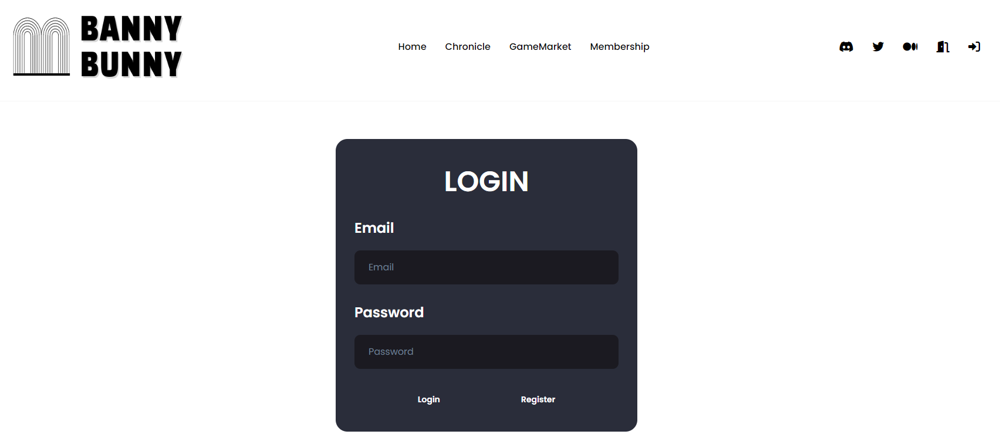

# BannuBunny
1st NFT Proj

# 목차 
 - [소개](#소개) 
 - [프로젝트 목적](#프로젝트-목적)
 - [사용 기술](#사용-기술)
 - [아키텍처](#아키텍처) 
 - [화면 구성](#화면-구성)
 - [주요 기능](#주요-기능)
    - [로그인](#로그인)  
    - [스마트 컨트랙트 & Web3](#스마트-컨트랙트--web3)
 - [Dev History](#dev-history)
 - [후기](#후기)

## 소개
프로젝트 BannyBunny는 멋쟁이 사자처럼과 바이낸스 BNB체인이 협업하여 개최한 해커톤에 참가한 결과물입니다. 
BNB 스마트 체인의 BNB코인으로 민팅한 NFT들을 오픈씨처럼 조회하도록 구현하였습니다. 
대략적인 사용자 시나리오는 다음의 블로그 에서 확인 할 수 있습니다. 
https://thththththeo.tistory.com/52

## 프로젝트 목적
단순한 토큰 교환이 아닌, NFT를 활용한 DApp 구현이 1차적인 목표였습니다. 
ipfs를 이용하여 실제 NFT 프로젝트들의 민팅을 구현하는데 집중하였습니다. 
점점 프로그램을 진행하면서는 어떤 서비스에 블록체인을 접목시키는 것이 적절하고, 
어떻게 하면 진행하는 프로젝트를 활성화 시킬 수 있는지에 대한 고민도 해 볼 수 있었습니다. 

## 사용 기술
**Front**
 
* 
&nbsp;
&nbsp;
&nbsp;
&nbsp;
&nbsp;

**Back**
 
* 

**DB**
 
* 

**3D**
 
* Blend My NFTs (https://github.com/torrinworx/BMNFTs_Examples) 
* 

**BlockChain**
 
* BNB Smart Chain test network 
* Pinata 
* Metamask 
* 
&nbsp;
&nbsp;

## 화면 구성
|||  |  |
| :-----------------------------------------------------------------------------------------------------------------: | :-----------------------------------------------------------------------------------------------------------------: | :-----------------------------------------------------------------------------------------------------------------: | :-----------------------------------------------------------------------------------------------------------------: |
|                                                      메인 페이지                                                      |                                                       로그인                                                        |                                                      세계관                                                       |                                                     보유 게임 페이지                                                      |

|  |  |  |  |
| :-----------------------------------------------------------------------------------------------------------------: | :-----------------------------------------------------------------------------------------------------------------: | :-----------------------------------------------------------------------------------------------------------------: | :-----------------------------------------------------------------------------------------------------------------: |
|                                                      지갑 연결 전                                                      |                                                       지갑 연결 후                                                        |                                                      보유 NFT 리스트                                                        |                                                     NFT 메타데이터 상세                                                      |

## 주요 기능
### 🌠로그인
   - 자체 로그인 방식으로는 회원가입시 입력한 비밀번호를 해시 암호화 알고리즘을 적용하여 나온 해시값을 DB에 저장합니다.  
   - 로그인시 사용한 해시 알고리즘을 찾아 비밀번호의 적합성을 검증합니다.  
### 🌠스마트 컨트랙트 & Web3
   - openzeppelin 라이브러리를 활용하여 웹 애플리케이션에서 사용할수 있는 ERC-721 기반 토큰입니다. 
   - Web3.js 라이브러리를 이용하여 배포 완료한 컨트랙트 주소와 ABI를 웹에서 읽을 수 있습니다. 
   - 지갑 연결된 경우, 지갑 계정에서 민팅된 NFT 리스트와 상세 메타데이터 내용을 확인 할 수 있습니다. 

## Dev History
개발과정에서의 주요 이슈 사항을 기록했습니다.
   - NFT를 3D로 만들 경우, Blend My NFTs 애드온 이용 -> three.js 라이브러리로 .gltf 파일을 로드 가능  
     BUT 피나타 ipfs의 용량을 많이 차지하므로, 애니메이션 영상으로 렌더링
   - react-unity-webgl 라이브러리 활용해 유니티로 만든 게임을 리액트 상에서 구현 가능 
     create-react-app으로 생성한 프로젝트에선 연동 성공 
     BUT 웹팩으로 설정한 해당 프로젝트에선 연동에 실패 -> 추가 시도 필요 

## 후기
NFT 교육과 해커톤을 무사히 마치고 난 후, 들었던 아쉬운 점은 다음과 같습니다. 
 
* 제한된 시간 때문에 미처 구현하지 못한 상점 기능, 유니티 연동 
* 제한된 시간 때문에 판매와 구입의 스마트 컨트랙트를 작성했음에도 불구하고, NFT 민팅과 리스트 조회만 구현 
* 해커톤의 방향성은 서비스의 기획을 중요시했으나, 초기엔 기능의 구현에만 몰입 
 
이 교육과 해커톤을 통해 프로젝트를 진행하면서 
서비스에 블록체인을 왜 도입해야 하는지, 서비스가 잘 유지되기 위해서 어떤 노력을 해야 하는지 등 
기능 구현 뿐만 아니라 근본적인 기획에 대한 생각도 깨우칠 수 있었습니다. 
 
이를 바탕으로 차후, (팀or개인)프로젝트에서 아쉬운 점들을 보완하여 완성해 나가고자 합니다. 

